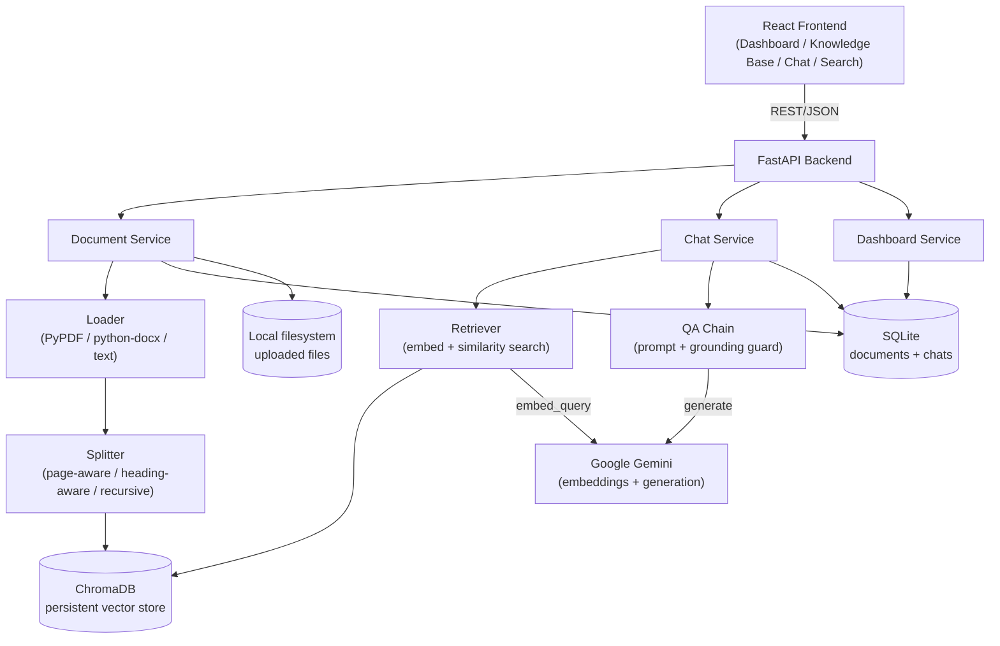
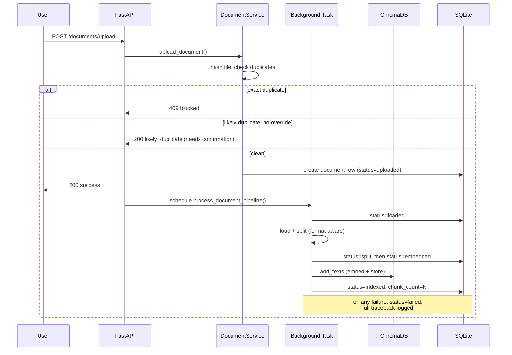
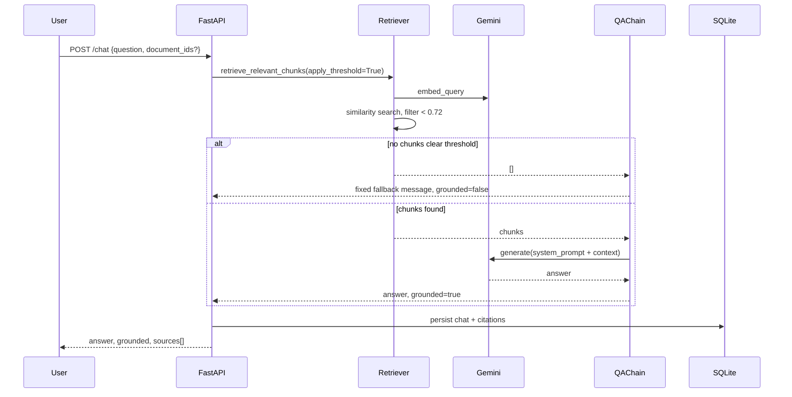
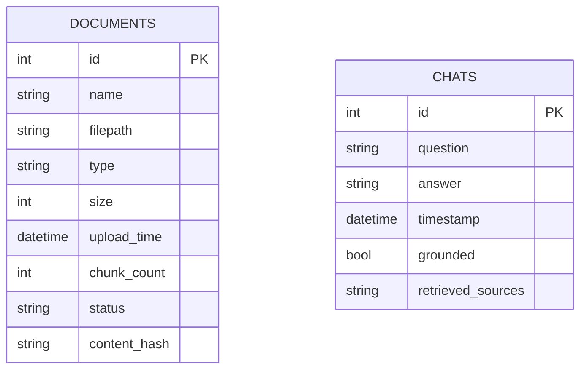

# System Design — KnowledgeHub AI

## 1. High-Level Architecture



## 2. Component Responsibilities

| Component | Responsibility |
|---|---|
| `api/routes/*` | HTTP boundary — request validation, status codes, no business logic |
| `services/document_service.py` | Upload validation, duplicate detection, orchestrates the ingestion pipeline, delete/reindex |
| `services/chat_service.py` | Orchestrates retrieval + generation for chat, retrieval-only for search, latency logging |
| `services/dashboard_service.py` | Aggregates document/chat stats |
| `rag/loader.py` | Reads raw files into LangChain `Document` objects, format-specific (page-aware PDF, heading-aware DOCX) |
| `rag/splitter.py` | Chunks documents — header-aware for Markdown/DOCX, recursive-character for everything else |
| `rag/embeddings.py` | Wraps the Gemini embedding model, pinned dimension |
| `rag/vectorstore.py` | Owns the Chroma collection lifecycle, enforces embedding-model/dimension consistency at startup |
| `rag/retriever.py` | Embeds a query, retrieves top-k chunks, optionally applies the grounding similarity threshold |
| `rag/chain.py` | Builds the grounded prompt, calls Gemini, enforces the no-answer fallback |
| `repositories/*` | All SQL access, isolated from service-layer logic |

## 3. Document Ingestion Flow



## 4. Chat Flow (Grounding Guarantee)



Search follows the same retrieval path but with `apply_threshold=False` — it returns ranked results regardless of score, since showing "closest matches" is search's job, not chat's hallucination guard.

## 5. Data Model



Chroma stores one vector per chunk, with metadata `{document_id, document_name, page, chunk_number, upload_time, file_type}` — `document_id` is the join key back to `DOCUMENTS`, used for both deletion (`where={"document_id": ...}`) and document-scoped chat/search filtering.

## 6. Key Design Decisions

- **Delete ordering is deliberate, not incidental.** Vectors are deleted from Chroma *before* the SQLite row or file — if a later step fails, the system is left with orphaned metadata but never orphaned, still-searchable vectors. That failure direction is logged loudly since there's no automated cleanup sweep yet.
- **Chat and search share retrieval code but not grounding behavior.** Both go through `DocumentRetriever.retrieve_relevant_chunks`, but chat applies the 0.72 similarity threshold (a hallucination guard) while search does not (its job is to surface ranked matches, not decide what's "answerable").
- **Embedding model is pinned and version-checked at startup**, not just at write time — a collection created with one model's dimensionality will refuse to silently accept vectors from a different one.
- **Format-aware chunking is achieved by normalization, not by parallel splitter implementations.** DOCX heading styles are converted to Markdown-style header syntax at load time, so DOCX and Markdown share the exact same header-aware splitting code path.

## 7. API Specification

The authoritative API spec is auto-generated from the FastAPI app (not hand-maintained, so it can't drift from the real endpoints): [openapi.json](openapi.json). Regenerate with:

```bash
curl -s http://localhost:8000/openapi.json | python3 -m json.tool > docs/openapi.json
```
